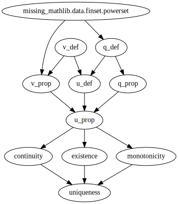

A formalised proof of existence and uniqueness of solution to the simultaneous debt and equity pricing problem on a banking network.
I gave a talk on the model and shared notes on this proof at the Conference on Systemic Risk and Financial Stability 2019 in Freiburg.
The paper is in preparation.

If the badge says "continuous integration passing" then the theorem is correct.


## What can I do with it?

To engage with the contents of this repository you will need some familiarity with [the Lean 3 theorem prover and its mathematical library](https://leanprover-community.github.io/).
You will also need a suitable environment.
One potentially cheap (browser only) way to get up and running is by clicking on this button.

[](https://gitpod.io/#https://github.com/agjftucker/exists-unique)

A better way is to install VS Code with Lean and community tools on your computer using [these instructions](https://leanprover-community.github.io/get_started.html).
You will then be able to run the following from the command line.

```
leanproject get agjftucker/exists-unique
code exists-unique
```

## What does it say?

Call a set of banks *viable* if under the assumption that all its members survive we calculate a positive equity for each.
This code constructs then proves unique a *survivors function* `φ` that, given a set of banks `A` and some change in asset values making `A` unviable, prescribes a new set of surviving banks maximal among viable subsets of `A`.
The survivors function determines debt and equity valuations in turn.
Our result shows that the circle of definitions is sensibly resolved.

Assumptions made are of a solution procedure `ℋ` for debt valuation and another `ℰ` for equity valuation satisfying properties obeyed by those we would use in practice.
Also that for every set of banks there is an amount by which external assets could fall to make it unviable*.

<p align="center"></p>
<p align="center">File Dependency Graph</p>

### [v_def](src/v_def.lean)

We consider times `t` up to a final (possibly infinite) time `T`.
At `t` we will be interested in maturities `τ` between `t` and `T`.
```lean
def Tt (T : with_top ℝ) : set ℝ := {t : ℝ | 0 ≤ t ∧ (t : with_top ℝ) < T}
def Tτ {T : with_top ℝ} (t : Tt T) : set ℝ := {τ : ℝ | t.1 < τ ∧ (τ : with_top ℝ) ≤ T}
```
Where `𝒩` is the set of banks, `X 𝒩` is the space of (log) external asset values.
```lean
def X (𝒩 : Type) := 𝒩 → ℝ
```
A *debt function* returns at any point in time and space a valuation for each bank's debt for each possible maturity.
```lean
def debt_fn (𝒩 : Type) (T : with_top ℝ) := ∀ (t : Tt T), X 𝒩 → 𝒩 → Tτ t → ℝ
```
Our model of credit risk is a structural one.
Properties of `ℋ` are modelled on those of a solution to the Black-Scholes-Merton parabolic partial differential equation.
Given a valuation function defined outside some time-dependent domain `V` (implying initial/boundary conditions), `ℋ` will return a function defined on the whole space.
```lean
structure well_behaved_soln :=
(ℋ : ∀ {V : Tt T → set (X 𝒩)} (v' : ∀ t y, y ∉ V t → Tτ t → ℝ), (∀ (t : Tt T), X 𝒩 → Tτ t → ℝ))
(matching_on_complement {V : Tt T → set (X 𝒩)} (v' : ∀ t y, y ∉ V t → Tτ t → ℝ) :
  ∀ t y h, ℋ v' t y = v' t y h)
(positivity_preserving {V : Tt T → set (X 𝒩)} (v' : ∀ t y, y ∉ V t → Tτ t → ℝ) :
  (∀ t y h, 0 ≤ v' t y h) → 0 ≤ ℋ v')
(continuity_preserving {V : Tt T → set (X 𝒩)} (v' : ∀ t y, y ∉ V t → Tτ t → ℝ) :
  continuous_wrt_assets_on_compl v' → continuous_wrt_assets (ℋ v'))
(translation_invariant {V : Tt T → set (X 𝒩)} (v' : ∀ t y, y ∉ V t → Tτ t → ℝ) :
  ∀ η t y, ℋ v' t (y + η) = ℋ (fun s x (h : x + η ∉ V s), v' s (x + η) h) t y)
(compatible_on_subsets {V V' : Tt T → set (X 𝒩)} {v' : ∀ t y, y ∉ V t → Tτ t → ℝ} :
  V' ⊆ V → ℋ v' = ℋ (fun t y (h : y ∉ V' t), ℋ v' t y))
(mono_wrt_val_on_compl {V : Tt T → set (X 𝒩)} {v₁ v₂ : ∀ t y, y ∉ V t → Tτ t → ℝ} :
  (∀ t y h, v₁ t y h ≤ v₂ t y h) → ℋ v₁ ≤ ℋ v₂)
```
The domain `V` associated with a set of banks `A` is exactly the region in which `A` is viable, and is derived from survivors function `ψ` as the set of points at which `ψ A = A`.
```lean
def V (ψ : ∀ (B : finset 𝒩), Tt T → X 𝒩 → 𝒫 B) (A : finset 𝒩) : Tt T → set (X 𝒩) :=
fun t y, A ≤ ψ A t y
```
Given a set of banks `B`, a survivors function for `B` and a debt function for each proper subset of `B`, we use `ℋ` to calculate a debt function for `B` itself.
```lean
def v_mk {B : finset 𝒩} (ψB : Tt T → X 𝒩 → 𝒫 B) :
  (∀ C < B, debt_fn 𝒩 T) → debt_fn 𝒩 T :=
fun υ t y i, if i ∈ B then ℋ (fun s x h, υ (ψB s x) ⟨(ψB s x).prop, h⟩ s x i) t y else 0
```
By induction we find debt functions for each set of banks up to the full set (likely the one we want).
```lean
def v (ψ : ∀ (B : finset 𝒩), Tt T → X 𝒩 → 𝒫 B) : finset 𝒩 → debt_fn 𝒩 T :=
finset.strong_induction (fun B, v_mk ℋ (ψ B))
```

### [u_def](src/u_def.lean)

Properties of `ℰ` are modelled on those of a solution procedure for a variational inequality performed in practice by iteration to a fixed point.
Given as input debt valuations at a point in time and space, `ℰ` will return equity valuations applying at that point.
```lean
def E_star (ℰ : ∀ (t : Tt T), X 𝒩 → (𝒩 → Tτ t → ℝ) → 𝒩 → ℝ) : debt_fn 𝒩 T → Tt T → X 𝒩 → 𝒩 → ℝ :=
fun υ t y, ℰ t y (υ t y)

structure equity_function :=
(ℰ : ∀ (t : Tt T), X 𝒩 → (𝒩 → Tτ t → ℝ) → 𝒩 → ℝ)
(mono_wrt_debt_valuation {t : Tt T} {y : X 𝒩} {υ₁ υ₂ : 𝒩 → Tτ t → ℝ} : υ₁ ≤ υ₂ → ℰ t y υ₁ ≤ ℰ t y υ₂)
(continuity_preserving {υ : debt_fn 𝒩 T} {t : Tt T} : continuous (υ t) → continuous (E_star ℰ υ t))
(mono_preserving_wrt_assets {υ : debt_fn 𝒩 T} : mono_wrt_assets υ → strict_mono_wrt_assets (E_star ℰ υ))
```

### [existence](src/existence.lean)

We specify three properties required of a survivors function.
Compare to the description given in the [first paragraph](#what-does-it-say) of this section.
```lean
structure survivors_fn (ψ :  ∀ (A : finset 𝒩), Tt T → X 𝒩 → 𝒫 A) : Prop :=
(idempotent : ∀ A t y, y ∈ V ψ (ψ A t y) t)
(maximal : ∀ A B t y, ↑(ψ A t y) < B → B ≤ A → y ∉ V ψ B t)
(consistent : ∀ A t y, y ∈ V ψ A t ↔ ∀ i ∈ A, 0 < E_star ℰ (v ℋ ψ A) t y i)
```

### [uniqueness](src/uniqueness.lean)

With one additional assumption (*)
```lean
variable (crash : ∀ ψ A t y,
  ∃ (η : ℝ) (hη : η ≤ 0) (i : 𝒩) (hi : i ∈ A), E_star ℰ (v ℋ ψ A) t (y + η) i ≤ 0)
```
we are able to prove that a survivors function exists and is unique.
```lean
theorem exists_unique_soln : ∃! ψ, survivors_fn ℋ ℰ ψ := ⟨φ ℋ ℰ, exists_soln, unique_soln crash⟩
```
