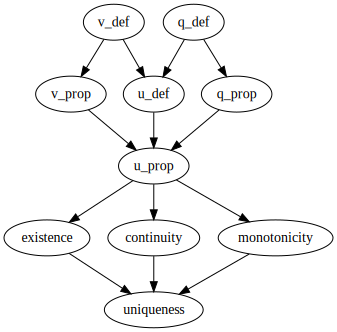

A formalised proof of existence and uniqueness of solution to the simultaneous debt and equity pricing problem on a banking network.
I gave a talk on the model and shared notes on this proof at the Conference on Systemic Risk and Financial Stability 2019 in Freiburg.
The paper is in preparation.

If the badge says "continuous integration passing" then the theorem is correct.


## What can I do with it?

To interact with the contents of this repository you will need some familiarity with [the Lean 3 theorem prover and its mathematical library](https://leanprover-community.github.io/).
You will also need a suitable environment.
One potentially cheap (browser only) way to get up and running is by clicking on this button.

[](https://gitpod.io/#https://github.com/agjftucker/exists-unique)

A better way is to install VS Code with Lean and community tools on your computer using [these instructions](https://leanprover-community.github.io/get_started.html).
You will then be able to run the following from the command line.

```
leanproject get agjftucker/exists-unique
code exists-unique
```

## What does it say?

Call a set of banks *viable* if under the assumption that all its members survive we calculate a positive equity for each.
This code constructs then proves unique a *survivors* function *φ* that, given a set of banks *A* and some change in asset values making *A* unviable, prescribes a new set of surviving banks maximal among viable subsets of *A*.
Through a relatively straightforward (though numerically demanding) procedure, the survivors function determines debt, then equity, valuations in turn; the resultant circle of definitions is unproblematic as long as we can establish existence and uniqueness at one point in it.

Assumptions made are of a solution procedure ℋ for debt valuation and another ℰ for equity valuation satisfying properties obeyed by those we would use in practice.
Also that for every set of banks there is an amount by which external assets could fall to make it unviable.

<p align="center"></p>
<p align="center">File Dependency Graph</p>

Properties of ℋ are modelled on those of a solution to the Black-Scholes-Merton parabolic partial differential equation. Debt is thus valued employing the principles of option pricing. Given a valuation function defined outside some time-dependent domain *V* (implying initial/boundary conditions), operator ℋ will return a function defined on the whole space (the solution). (Formalised in [v_def.lean](src/v_def.lean).)
1. `matching_on_complement` The function supplied in a set of conditions with domain *V* will match the solution on the complement of *V*.
2. `positivity_preserving` If the function supplied in a set of conditions is nonnegative then the solution will be nonnegative.
3. `continuity_preserving` If the function supplied in a set of conditions is continuous then the solution will be continuous.
4. `translation_invariant` If one set of conditions matches another but translated in space, then the solution for the one will match the solution for the other likewise translated.
5. `compatible_on_subsets` If the solution for one set of conditions with domain *V* matches the function supplied in another with domain *V'* a subset of *V* then the two solutions will match.
6. `mono_wrt_val_on_compl` If the function supplied in one set of conditions is nowhere less than the function supplied in another with the same domain then the solution for the one will be nowhere less than the solution for the other.

Properties of ℰ are modelled on those of a solution procedure for a certain variational inequality, performed in practice by iteration to a fixed point. Given as input debt valuations at a point in space-time, ℰ will return equity valuations applying at that point. (Formalised in [u_def.lean](src/u_def.lean).)
1. `mono_wrt_debt_valuation` If for no bank is debt valuation in one set of inputs less than in another then for no bank will equity valuation resulting from the one be less than from the other.
2. `continuity_preserving` If each debt valuations in a set of inputs is a continuous function of space then each equity valuation will be likewise continuous.
3. `mono_preserving_wrt_assets` If each debt valuation in a set of inputs is a function nondecreasing as asset values climb then each equity valuation will be strictly increasing.
